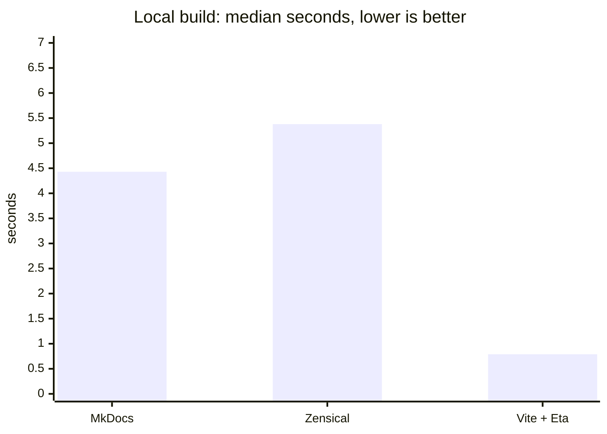
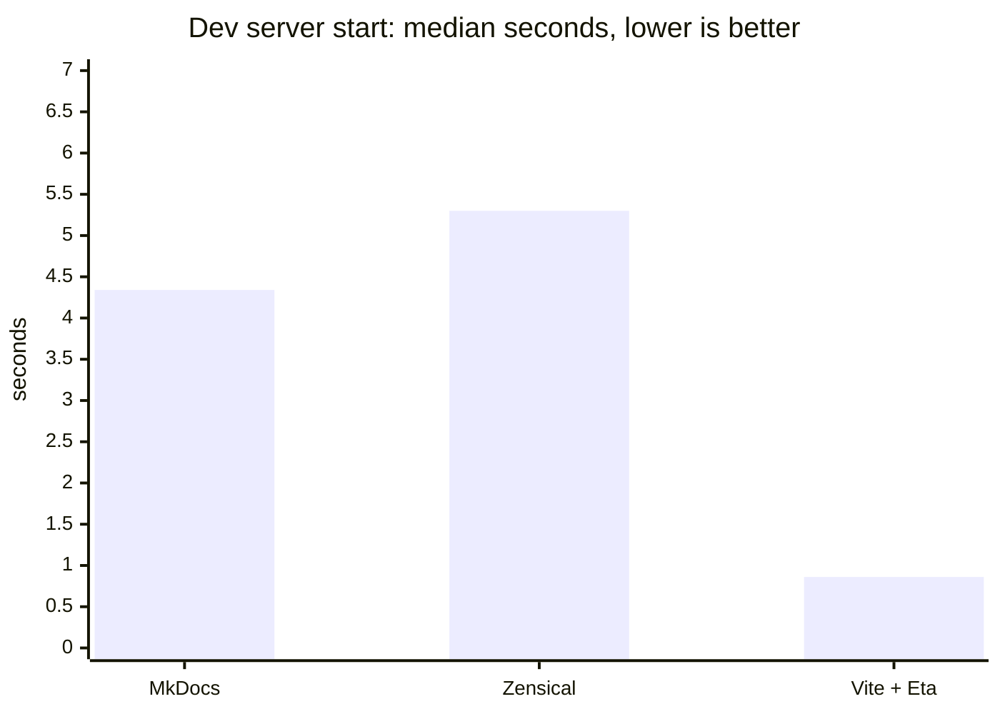
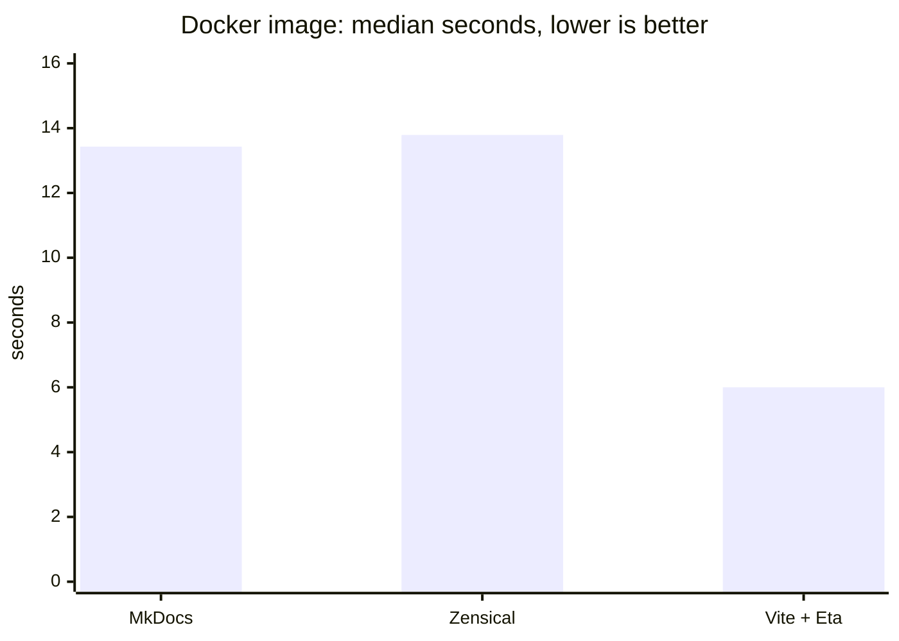

# Docs site built with Vite and Eta (exploratory)

## Problem

[Plan 3002-zensical-docs](3002-zensical-docs.md) showed Zensical is no
faster than MkDocs here: both render with single-threaded Python-Markdown.
This variant tries a Node pipeline instead: `marked` for Markdown and the
`vite-ssr-i18n-basic` Vite plugin for pages, as on pierreguilbert.com.

## What it is

Everything lives in `docs/eta/`; the build in `docs/` is untouched.

- The plugin renders `docs/src/**/*.md` directly (`pagesDir: "../src"`),
  with the Markdown pages from the unreleased
  [plugin PR #5](https://github.com/guilbep/vite-ssr-i18n-basic/pull/5)
  (stacked on [#4](https://github.com/guilbep/vite-ssr-i18n-basic/pull/4)),
  pinned as a GitHub tarball of its head commit.
- `scripts/prepare.mjs` writes what the plugin cannot know: the section
  and plan indexes (a port of `gen_indexes.py`, byte-identical output,
  same non-zero exit on an unknown status), the sidebar nav from
  `zensical.toml` as `src/data/meta.json`, `routes.config.json`, and page
  images.
- `scripts/marked-extensions.mjs`: Python-Markdown heading ids, so
  `page.md#anchor` links keep working, and Mermaid blocks.
- The layout renders the nav from data with a recursive partial;
  `minifyHtml: false`.
- `Dockerfile` builds from the `docs/` context:
  `docker build -f docs/eta/Dockerfile docs/`.
- Opt-in `docs/Makefile` targets: `install-docs-eta`, `build-docs-eta`
  (build + `check_links.py`), `serve-docs-eta` (port 8002),
  `docker-build-run-eta`. `build-docs`, CI and the deployed image stay on
  Zensical until a variant is chosen.

## Benchmark: 30 runs each

Apple M4 Pro (14 cores, 24 GB), macOS 26.5.1, Docker 29.8.0. Pinned code:
MkDocs `dev@eda37fd` with `MKDOCS_FULL_BUILD=false` (what the image and CI
build), Zensical `docs/3002-zensical@b9b37b3`, Vite + Eta
`docs/3002-eta-docs@1b97ab0` (vite-ssr-i18n-basic 3.2.0 code). One warm-up
round, then 30 rounds; each round runs every metric for all three tools,
rotating the order. A run counts only if it exits 0 and emits at least 380
pages.

- **build**: the Dockerfile's site step, run locally from clean
  (`mkdocs build --strict`; `gen_indexes.py` + `zensical build --clean
--strict`; `prepare.mjs` + `vite build`).
- **serve**: process start until `/glossary.html` answers 200 with its
  content.
- **docker**: `docker buildx build --no-cache --load` on a dedicated
  builder: no layer reuse, warm uv/npm download caches.

#### Local build (site generation from clean)

| Tool       |   n | median |   mean |    std |    min |    max | speed vs MkDocs |
| ---------- | --: | -----: | -----: | -----: | -----: | -----: | --------------: |
| MkDocs     |  30 | 4.43 s | 4.51 s | 0.23 s | 4.24 s | 5.43 s |            1.0× |
| Zensical   |  30 | 5.38 s | 5.38 s | 0.11 s | 5.13 s | 5.65 s |            0.8× |
| Vite + Eta |  30 | 0.79 s | 0.80 s | 0.05 s | 0.72 s | 0.92 s |            5.6× |

#### Dev server start (process start → /glossary.html served)

| Tool       |   n | median |   mean |    std |    min |    max | speed vs MkDocs |
| ---------- | --: | -----: | -----: | -----: | -----: | -----: | --------------: |
| MkDocs     |  30 | 4.34 s | 4.37 s | 0.10 s | 4.22 s | 4.57 s |            1.0× |
| Zensical   |  30 | 5.30 s | 5.29 s | 0.09 s | 5.13 s | 5.47 s |            0.8× |
| Vite + Eta |  30 | 0.86 s | 0.86 s | 0.05 s | 0.79 s | 1.01 s |            5.1× |

#### Docker image (--no-cache build, warm package cache)

| Tool                                                                     |   n |  median |    mean |    std |     min |     max | speed vs MkDocs |
| ------------------------------------------------------------------------ | --: | ------: | ------: | -----: | ------: | ------: | --------------: |
| MkDocs                                                                   |  30 | 13.43 s | 14.95 s | 3.61 s | 11.78 s | 22.94 s |            1.0× |
| Zensical                                                                 |  30 | 13.79 s | 14.31 s | 1.77 s | 11.53 s | 19.37 s |            1.0× |
| Vite + Eta                                                               |  30 |  6.00 s |  6.17 s | 0.73 s |  5.20 s |  8.46 s |            2.2× |
| Not in the series: MkDocs' local default (`make build-docs` /            |
| `serve-docs` with the git plugins) takes about 30 s to build and 61 s to |
| start serving.                                                           |

### Notes

`vite build` dropped from 0.55–0.71 s to 0.5 s once the plugin cached
compiled Eta templates in production (#4): the recursive nav partial
was recompiled on every page.

The plugin's per-page `html-minifier-terser` took 1.5 s of a 1.8 s
`vite build` and saved 0.1 MB, so it is off. MkDocs and Zensical do not
minify either, which makes the main rows like for like on that point.

Part of the gap is doing less work. This variant has no search index,
no 404 page, no per-page table of contents, no Material theme, no
admonitions, footnotes or `attr_list` (one page each), and no syntax
highlighting (Zensical runs Pygments on 197 pages).

Markdown live reload works: under `npm run dev`, an edit to a page in
`docs/src/` is served on the next request, about a second later. The
indexes and nav are written once at start; restart for a new plan or a
nav change.

## Verification

- Same pages at the same paths as Zensical, minus `404.html`.
  `check_links.py dist`: 0 broken.
- Heading ids match Zensical on 358 of 386 pages. 27 differ only because
  Python-Markdown turns `#2487 text` (no space) into a heading and
  CommonMark does not; one archived plan gains a heading.
- A planted `status: draft` fails the converter.

## Plugin feedback

Filed as [guilbep/vite-ssr-i18n-basic#3](https://github.com/guilbep/vite-ssr-i18n-basic/issues/3).
[#4](https://github.com/guilbep/vite-ssr-i18n-basic/pull/4) (3.1.0):
`emitRootRedirect` (off for one locale), `minifyHtml`, render failures
fail the build, directory check at build start, no hardcoded `en`/`fr`,
no debug logs, `sharp` 0.35.5.
[#5](https://github.com/guilbep/vite-ssr-i18n-basic/pull/5): Markdown
pages. Still open: copying images next to pages, which `prepare.mjs`
does here.

## Decision

Open. Fastest of the three, but it trades features for speed. Adopting
it means plugin releases with #4 and #5, rebuilding search,
highlighting, the 404 page and admonitions, and deleting `gen_indexes.py`
for the port.
