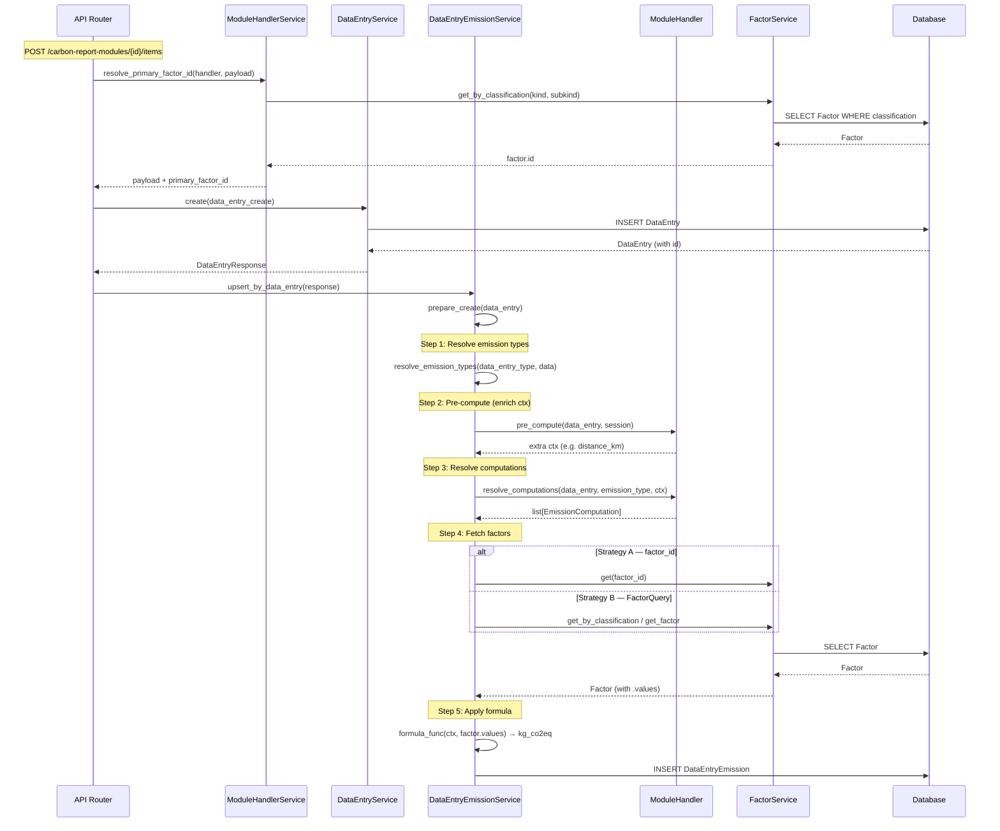

# Emission Pipeline Flow

> Reference documentation for the emission calculation pipeline.
> Describes how `DataEntryEmission` rows are produced from a `DataEntry`.

---

## Pipeline Overview



---

## Pipeline Steps

### Step 1 — Resolve Emission Types

`resolve_emission_types(data_entry_type, data)` returns the list of
`EmissionType` leaves to produce for this data entry. Each leaf becomes one
(or more) `DataEntryEmission` row.

### Step 2 — Pre-compute (`handler.pre_compute`)

Enriches the context dict with values that require **DB access** or
**non-trivial arithmetic** from user data only. The returned dict is merged
into `ctx = {**data_entry.data, **pre_compute_result}`.

**Rule:** `pre_compute` must NOT read factor values. Factor data is only
available at Step 5 via `factor_values`.

### Step 3 — Resolve Computations (`handler.resolve_computations`)

Declares one `EmissionComputation` per factor lookup needed. Each computation
specifies either:

- **Strategy A** — `factor_id` (int): direct lookup by ID
- **Strategy B** — `factor_query` (FactorQuery): classification-based lookup

### Step 4 — Fetch Factors (`_fetch_factors`)

Retrieves `Factor` objects from the database using the strategy declared in
Step 3. For Strategy B, progressive fallbacks are attempted (see below).

### Step 5 — Apply Formula (`_apply_formula` / `formula_func`)

Computes `kg_co2eq` from `ctx` (user data + pre-computed values) and
`factor_values` (from the fetched Factor). Two approaches:

| Approach           | When                   | How                                                      |
| ------------------ | ---------------------- | -------------------------------------------------------- |
| **Key-based**      | Simple `quantity × ef` | `formula_key`, `quantity_key`, optional `multiplier_key` |
| **`formula_func`** | Complex logic          | `formula_func(ctx, factor_values) → float`               |

---

## Factor Retrieval Strategies

| Strategy                 | Trigger                                  | Returns      | Used by                                                                                                       |
| ------------------------ | ---------------------------------------- | ------------ | ------------------------------------------------------------------------------------------------------------- |
| **A — direct factor_id** | `primary_factor_id` in `data_entry.data` | 1 factor     | Equipment, Purchase, Process Emissions, External Cloud/AI, Research Facilities, Energy Combustion , Buildings |
| **B — FactorQuery**      | `FactorQuery(kind, subkind, context)`    | 1..N factors | Travel (plane/train), Headcount (member/student)                                                              |

### Strategy B Fallback Order

1. Full classification (subkind + context + fallbacks)
2. Kind only (no subkind/context)
3. By emission_type → returns N factors
4. By data_entry_type → broadest

---

## Rematch: How Factor Changes Propagate (Plan 310-D)

When a factor is updated (CSV reupload, manual edit), existing
`DataEntry` rows must be re-linked to the new factor IDs and their
`DataEntryEmission` rows recomputed. **Where the link is stored
governs the rematch path** — and it's a different axis from the
factor-retrieval Strategy A/B above.

| Link location                                 | Rematch shape        | Modules                                                                                                                                           | Status        |
| --------------------------------------------- | -------------------- | ------------------------------------------------------------------------------------------------------------------------------------------------- | ------------- |
| `data_entries.data->primary_factor_id` (JSON) | 1:1 or 1:N per entry | Equipment, Purchase (common + additional), Process Emissions, External Cloud, External AI, Buildings — Energy Combustion, Buildings — Rooms (1:N) | ✅ Plan 310-D |
| `data_entry_emissions.primary_factor_id` (FK) | 1:N per entry        | Travel (plane / train), Headcount (member / student), Buildings — Embodied Energy                                                                 | ✅ PR #1042   |

**Why two paths**: the JSON-link modules carry the factor on the entry
itself — the rematch updates the JSON column on the entry, and any
fan-out to multiple emission rows (Buildings Rooms emits one row per
`room_type`) follows from the same canonical entry-side link. The
FK-link modules either generate multiple emission rows per entry from
sub-factors (Headcount) OR resolve their factor via `FactorQuery` at
compute time so the link only ever lived on the emission row (Travel).
For FK-link, the rematch walks `data_entry_emissions` directly via
`upsert_by_data_entry` — `pre_compute` + `_fetch_factors` re-runs the
live Strategy B query, which is empirically what propagates new factor
values into the existing chain (PR #1042 finding — no workflow code
change was required for FK-link rematch; only test coverage was missing).

### Plan 310-D Rematch Contract (JSON-link modules)

`EmissionRecalculationWorkflow.recalculate_for_data_entry_type`:

1. **Single bulk-fetch** — all factors for `(data_entry_type_id,
year)` in one query, indexed in a Python dict keyed by
   `(kind, subkind)`. No per-entry DB roundtrips.
2. **In-memory kind→subkind→kind-only fallback** — mirrors the chain
   `ModuleHandlerService.resolve_primary_factor_id` runs in DB. Try
   `(kind, subkind)` first; on miss with subkind set, fall through
   to `(kind, None)` (only succeeds if a `subkind=NULL` row was
   prefetched).
3. **Strict-drop on overall miss** — a factor not in the current CSV
   is treated as deleted. The entry's `primary_factor_id` is cleared
   on the in-memory `entry.data`, then `upsert_by_data_entry` is called
   with the now-unmatched payload — `prepare_create` returns no
   computations and the no-emissions branch invokes
   `delete_by_data_entry_id`, so **the entry's existing emission rows
   are removed**. The entry itself stays around (so operators see the
   missing-factor signal on the dashboard) but no `kg_co2eq` row
   persists. (Earlier wording said "set `kg_co2eq` to None"; the
   actual code deletes the row entirely — see PR #1042's
   strict-drop clarification in `310-d-strategy-b-rematch.md`.)
4. **Year-strict** — `(year IS NULL)` factors do not satisfy a
   year-scoped query. No fallback; if no year-matched factor exists,
   the entry's link is dropped per rule 3.
5. **Per-entry rollback** — the in-memory `entry.data` mutation is
   restored if `upsert_by_data_entry` raises, so a partial-failure
   batch never persists a stale `primary_factor_id` next to an old
   `data_entry_emissions` row.

The Strategy B handlers (kind_field declared but value derived in
`pre_compute`, e.g. travel) are skipped by the gate
`kind_field is not None and kind_field in entry.data` — their
correct rematch path lands in the follow-up
([310-d-strategy-b-rematch](310-d-strategy-b-rematch.md)).

---

## Per-Module Breakdown

### Professional Travel — Plane

| Step                   | What happens                                                                                                              |
| ---------------------- | ------------------------------------------------------------------------------------------------------------------------- |
| `pre_compute`          | Fetches origin/destination `Location` from DB. Computes `distance_km` (haversine) and `haul_category` (short/medium/long) |
| `resolve_computations` | Strategy B — `FactorQuery(kind=haul_category)`                                                                            |
| Formula                | Key-based: `distance_km × ef_kg_co2eq_per_km × rfi_adjustment`                                                            |

### Professional Travel — Train

| Step                   | What happens                                                                             |
| ---------------------- | ---------------------------------------------------------------------------------------- |
| `pre_compute`          | Fetches origin/destination `Location` from DB. Computes `distance_km` and `country_code` |
| `resolve_computations` | Strategy B — `FactorQuery(kind=country_code, fallbacks={"kind": "RoW"})`                 |
| Formula                | Key-based: `distance_km × ef_kg_co2eq_per_km`                                            |

### Equipment Electric Consumption (IT / Scientific / Other)

| Step                   | What happens                                                                                                                                                                                                                                                                 |
| ---------------------- | ---------------------------------------------------------------------------------------------------------------------------------------------------------------------------------------------------------------------------------------------------------------------------- |
| `pre_compute`          | Validates `active_usage_hours + standby_usage_hours ≤ 168`                                                                                                                                                                                                                   |
| `resolve_computations` | Strategy A — `factor_id = primary_factor_id`                                                                                                                                                                                                                                 |
| Formula                | `formula_func`: reads `active_power_w`, `standby_power_w`, `ef_kg_co2eq_per_kwh` from `factor_values`; reads hours from `ctx`. Computes `annual_kwh = ((active_hours × active_power_w) + (standby_hours × standby_power_w)) × WEEKS_PER_YEAR / 1000`, then `annual_kwh × ef` |

### Buildings — Rooms

| Step                   | What happens                                                                                                                                                                                              |
| ---------------------- | --------------------------------------------------------------------------------------------------------------------------------------------------------------------------------------------------------- |
| `pre_compute`          | No override (default returns `{}`)                                                                                                                                                                        |
| `resolve_computations` | Strategy B — `FactorQuery(kind=building_name, subkind=room_type)`. One computation per emission type (lighting, cooling, ventilation, heating_elec, heating_thermal)                                      |
| Formula                | `formula_func`: reads `kwh_per_square_meter` field (varies by emission type) from `factor_values`, multiplies by `room_surface_square_meter` from `ctx`, then `× ef_kg_co2eq_per_kwh × conversion_factor` |

### Buildings — Energy Combustion

| Step                   | What happens                                 |
| ---------------------- | -------------------------------------------- |
| `pre_compute`          | No override                                  |
| `resolve_computations` | Strategy A — `factor_id = primary_factor_id` |
| Formula                | Key-based: `quantity × kg_co2eq_per_unit`    |

### Headcount (Member / Student)

| Step                   | What happens                                                                           |
| ---------------------- | -------------------------------------------------------------------------------------- |
| `pre_compute`          | No override                                                                            |
| `resolve_computations` | Strategy B — `FactorQuery(data_entry_type, no kind/subkind)` → returns all sub-factors |
| Formula                | Key-based: `fte × ef_kg_co2eq_per_fte`                                                 |

### Purchase (Common)

| Step                   | What happens                                               |
| ---------------------- | ---------------------------------------------------------- |
| `pre_compute`          | No override                                                |
| `resolve_computations` | Strategy A — `factor_id = primary_factor_id`               |
| Formula                | Key-based: `total_spent_amount × ef_kg_co2eq_per_currency` |

### Purchase (Additional)

| Step                   | What happens                                           |
| ---------------------- | ------------------------------------------------------ |
| `pre_compute`          | No override                                            |
| `resolve_computations` | Strategy A — `factor_id = primary_factor_id`           |
| Formula                | `formula_func`: `annual_consumption × coef_to_kg × ef` |

### External Cloud

| Step                   | What happens                                         |
| ---------------------- | ---------------------------------------------------- |
| `pre_compute`          | No override                                          |
| `resolve_computations` | Strategy A — `factor_id = primary_factor_id`         |
| Formula                | Key-based: `spent_amount × ef_kg_co2eq_per_currency` |

### External AI

| Step                   | What happens                                                   |
| ---------------------- | -------------------------------------------------------------- |
| `pre_compute`          | No override                                                    |
| `resolve_computations` | Strategy A — `factor_id = primary_factor_id`                   |
| Formula                | `formula_func`: `frequency × 5 × 46 × users × factor_g / 1000` |

### Process Emissions

| Step                   | What happens                                        |
| ---------------------- | --------------------------------------------------- |
| `pre_compute`          | No override                                         |
| `resolve_computations` | Strategy A — `factor_id = primary_factor_id`        |
| Formula                | `formula_func`: `quantity_kg × gwp_kg_co2eq_per_kg` |

### Research Facilities

| Step                   | What happens                                 |
| ---------------------- | -------------------------------------------- |
| `pre_compute`          | No override                                  |
| `resolve_computations` | Strategy A — `factor_id = primary_factor_id` |
| Formula                | TBD — currently returns empty list           |

---

## Data Enrichment for LIST/GET Responses

The `get_submodule_data()` repository method enriches `data_entry.data` with
factor information for display purposes:

```python
data_entry.data = {
    **data_entry.data,
    "kg_co2eq": total_kg_co2eq,
    "primary_factor": {
        **factor.values,          # e.g. active_power_w, ef_kg_co2eq_per_kwh
        **factor.classification,  # e.g. kind, subkind
    }
}
```

This enriched `primary_factor` dict is used by `to_response()` to extract
display fields (e.g. `active_power_w` for equipment, `kwh_per_square_meter`
for buildings). It is **only available during LIST/GET**, NOT during emission
creation.

**Important:** `pre_compute` and `formula_func` must never rely on the
`primary_factor` dict in `data_entry.data`. Factor values are available via
`factor_values` parameter in `formula_func` / `_apply_formula`.
