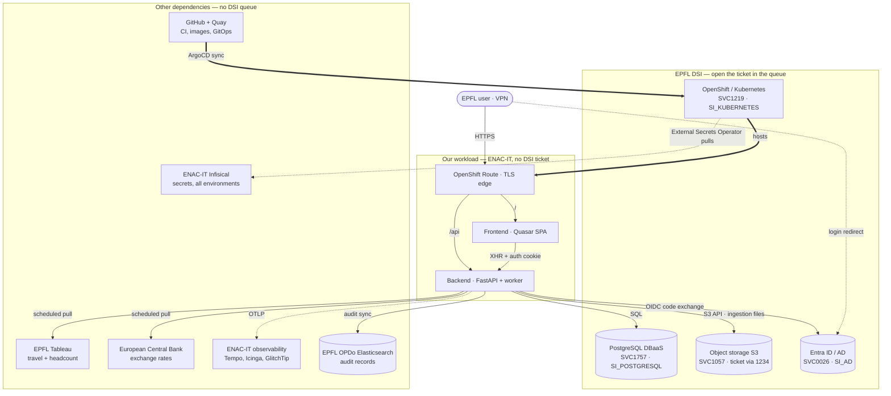

# Operations: Something Is Broken

Where to look first, who to call, and what to expect, for dev, stage and
prod. Read this page before anything else during an incident. Severity
tiers, communication and personal-data rules are in
[Incident Response](../architecture/incident-response.md); a full rebuild
is the private
[Disaster Recovery Plan](https://github.com/EPFL-ENAC/openshift-app-config/blob/main/epfl/co2-calculator/DRP.md).
This is a multi-procedure runbook and runs longer than the usual page
budget on purpose.

## What to expect

- Support is **best effort, working hours**. There is no on-call rotation
  and nobody is paged.
- Prometheus/Alertmanager and Icinga mail the `co2-calculator-sysadmins`
  group, and nothing else. GlitchTip mails the same group **and** posts to
  the private co2-calculator Teams channel.
- **End users** report problems to the EPFL service desk,
  `1234@epfl.ch`, which routes them to us.

## First ten minutes

1. **Icinga** ([status page](https://enacitmonitoring22.epfl.ch/icingaweb2/),
   host group `co2-calculator`): is the host UP, are `https`, `https-api`
   and `pgsql` green? Red `https-api` and `pgsql` together means the
   database. Red `https` alone means the Route or the frontend.
2. **Alert mail**: which alert, which environment, since when. Every
   alert name is explained in the
   [alert catalog](03-observability-slo.md#alert-catalog-devstage-prod-matches-except-where-noted-above).
3. **Grafana "specific graphs"** for that environment (links below):
   latency by `route_class`, DB pool checkouts, HTTP errors by status
   code. This is the dashboard the lead opens first.
4. **ArgoCD**: is the application Synced and Healthy? A
   `chore(manifest)` commit close to the symptom start is the usual
   suspect. Revert it in the GitOps repo; ArgoCD rolls back on its own.
5. **Traces** in Tempo: [enac-k8s-grafana](https://enac-k8s-grafana.epfl.ch/),
   Explore, Tempo data source, filter by service and route in the time
   window. Since [#2372](../implementation-plans/2372-traceparent-propagation.md)
   a GlitchTip event's `trace_id` is expected to match the backend spans
   in Tempo. **Not yet verified end to end**: treat a miss as unconfirmed,
   not as proof the request never reached the backend.
   Recipes: [Debugging with traces](06-debugging-with-traces.md).
6. **Pod logs** in the OpenShift console (links below), or:

```bash
oc login --web
oc logs deploy/co2-calculator-backend -n <namespace> --tail=200
oc get externalsecret,pods -n <namespace>
```

## Links per environment

| Where                     | dev                                                                                                                                                                                            | stage                                                                                                                                                                        | prod                                                                                                                                                                        |
| ------------------------- | ---------------------------------------------------------------------------------------------------------------------------------------------------------------------------------------------- | ---------------------------------------------------------------------------------------------------------------------------------------------------------------------------- | --------------------------------------------------------------------------------------------------------------------------------------------------------------------------- |
| App                       | [co2-calculator-dev.epfl.ch](https://co2-calculator-dev.epfl.ch)                                                                                                                               | [co2-calculator-stage.epfl.ch](https://co2-calculator-stage.epfl.ch)                                                                                                         | [co2-calculator.epfl.ch](https://co2-calculator.epfl.ch)                                                                                                                    |
| Grafana, specific graphs  | [open](https://grafana-dev-route-grafana-dev.apps.ocpitsd0001.xaas.epfl.ch/d/ndr79mm/specific-graphs?orgId=1&from=now-12h&to=now)                                                              | [open](https://grafana-test-route-grafana-test.apps.ocpitst0001.xaas.epfl.ch/d/ndr79mm/specific-graphs?orgId=1&from=now-12h&to=now)                                          | [open](https://grafana-prod-route-grafana-prod.apps.ocpitsp0001.xaas.epfl.ch/d/ndr79mm/specific-graphs?orgId=1&from=now-12h&to=now)                                         |
| Grafana, namespace        | [open](https://grafana-dev-route-grafana-dev.apps.ocpitsd0001.xaas.epfl.ch/d/test-sa-dashboard/standard-namespace-monitoring-recording-rule?orgId=1&var-namespace=svc1751d-co2-calculator-dev) | [open](https://grafana-test-route-grafana-test.apps.ocpitst0001.xaas.epfl.ch/d/k8s_views_ns/kubernetes-views-namespaces?orgId=1&var-namespace=svc1751t-co2-calculator-stage) | [open](https://grafana-prod-route-grafana-prod.apps.ocpitsp0001.xaas.epfl.ch/d/k8s_views_ns/kubernetes-views-namespaces?orgId=1&var-namespace=svc1751p-co2-calculator-prod) |
| ArgoCD application        | [open](https://openshift-gitops-server-openshift-gitops.apps.ocpitsd0001.xaas.epfl.ch/applications/openshift-gitops/co2-calculator-dev?view=tree)                                              | [open](https://openshift-gitops-server-openshift-gitops.apps.ocpitst0001.xaas.epfl.ch/applications/openshift-gitops/co2-calculator-stage?view=tree)                          | [open](https://openshift-gitops-server-openshift-gitops.apps.ocpitsp0001.xaas.epfl.ch/applications/openshift-gitops/co2-calculator-prod?view=tree)                          |
| Console, application logs | [open](https://console-openshift-console.apps.ocpitsd0001.xaas.epfl.ch/monitoring/logs?q=%7B+log_type%3D%22application%22+%7D+%7C+json)                                                        | [open](https://console-openshift-console.apps.ocpitst0001.xaas.epfl.ch/monitoring/logs?q=%7B+log_type%3D%22application%22+%7D+%7C+json)                                      | [open](https://console-openshift-console.apps.ocpitsp0001.xaas.epfl.ch/monitoring/logs?q=%7B+log_type%3D%22application%22+%7D+%7C+json)                                     |
| OpenShift console         | [open](https://console-openshift-console.apps.ocpitsd0001.xaas.epfl.ch)                                                                                                                        | [open](https://console-openshift-console.apps.ocpitst0001.xaas.epfl.ch/)                                                                                                     | [open](https://console-openshift-console.apps.ocpitsp0001.xaas.epfl.ch/)                                                                                                    |

Cross-environment: [Icinga](https://enacitmonitoring22.epfl.ch/icingaweb2/),
[Tempo](https://enac-k8s-grafana.epfl.ch/),
[GlitchTip](https://enac-it-glitchtip.epfl.ch),
[Matomo](https://enac-webanalytics.epfl.ch/piwik/). The same links are on
the backoffice Logs page inside the app. What each tool is for and how to
get an account: [Tools and access](05-tools-and-access.md).

## Symptom to owner

Follow an arrow backwards from the symptom to whoever owns it. Anything in
the DSI box has a service number and a support queue: **open the incident
directly in that queue**. A ticket in the wrong queue is re-routed by hand
and costs hours at the worst possible moment.



| Dependency                  | Service                               | Queue                        | Open a ticket when                                                             |
| --------------------------- | ------------------------------------- | ---------------------------- | ------------------------------------------------------------------------------ |
| OpenShift / Kubernetes      | [SVC1219](https://go.epfl.ch/SVC1219) | `SI_KUBERNETES`              | Pods will not schedule, Route down, wildcard certificate, cluster-wide failure |
| PostgreSQL (DBaaS)          | [SVC1757](https://go.epfl.ch/SVC1757) | `SI_POSTGRESQL`              | Database unreachable, restore or point-in-time recovery request                |
| Object storage (S3)         | [SVC1057](https://go.epfl.ch/SVC1057) | `1234@epfl.ch` + bucket name | Bucket unreachable, S3 credentials rejected                                    |
| Entra ID / Active Directory | [SVC0026](https://go.epfl.ch/SVC0026) | `SI_AD`                      | Login broken, group or role claims missing                                     |

Numbers and queues are as supplied by EPFL DSI. The linked service page
carries the current service manager; read it there rather than trusting a
name copied into a doc.

**Object storage has no published `SI_` queue.** Open the ticket at
`1234@epfl.ch` and give the bucket name: it is `S3_BUCKET` in the backend
secret, set from the GitOps overlay. Buckets are ordered and managed
through the VPSI XaaS portal (<https://portal-xaas.epfl.ch>,
[FAQ](https://inside.epfl.ch/portal-xaas/s3-object-storage-faq/)).

Infisical, Tableau, the ECB feed, GitHub and the ENAC-IT observability
stack are **not DSI services**; an `SI_` ticket for them goes nowhere.
Contact ENAC-IT (roster in the DRP) for Infisical, Tempo, Icinga and
GlitchTip; the others are vendor or data-source issues.

## Ours: symptom, cause, action

| Symptom                                                   | Usual cause                                               | Do                                                                                                                                                                                                           |
| --------------------------------------------------------- | --------------------------------------------------------- | ------------------------------------------------------------------------------------------------------------------------------------------------------------------------------------------------------------ |
| `CreateContainerConfigError` or CrashLoop after a rollout | A secret key is missing or a setting is invalid           | `oc get externalsecret -n <ns>` and `oc describe pod`; fix the key in Infisical or the overlay, then `oc rollout restart deploy/co2-calculator-backend`                                                      |
| `ImagePullBackOff`                                        | Tag not in Quay yet, or the pull robot credential expired | Check the GitHub Actions run, then the `quay-reg-cred` ExternalSecret                                                                                                                                        |
| `DbPoolCheckoutTimeout`                                   | Pool exhausted by long transactions or orphaned slots     | Grafana DB pool panel; read plans [2566](../implementation-plans/2566-db-pool-disposal-and-visibility.md) and [1723](../implementation-plans/1723-job-concurrency-and-db-pool.md) before touching pool sizes |
| Many users get 403 at once                                | Role sync received an empty list from the provider        | Plan [2531](../implementation-plans/2531-role-sync-empty-response-wipe.md); check `/api/health/deps` for the role provider                                                                                   |
| Upload or recalculation never finishes                    | Stuck job                                                 | `GET /api/health/stale-stats`; plans [1219](../implementation-plans/1219-stuck-jobs-and-pipeline-progress.md) and [1559](../implementation-plans/1559-ingestion-idempotent-tmp-to-processing-move.md)        |
| `HighErrorRate`, `LatencyP99High`                         | A slow or failing route                                   | Grafana errors by status code, then Tempo for the slowest traces on that route                                                                                                                               |
| `BackendMetricsAbsent`                                    | Backend pods down, or the OTel collector pod down         | `oc get pods -n <ns>`; the collector is `otel-collector`                                                                                                                                                     |
| Icinga `ssl-cert` warning                                 | Cluster wildcard certificate nearing expiry               | Not ours: `SI_KUBERNETES`                                                                                                                                                                                    |
| Icinga `pgsql` CRITICAL, app still up                     | Probe path to DBaaS, or DBaaS maintenance                 | Check `/api/health/deps`; if the app is failing too, `SI_POSTGRESQL`                                                                                                                                         |

## Recovery

- **Bad deploy**: revert the GitOps commit. ArgoCD reconciles within
  minutes.
- **Database**: nightly dump on the `db-dumps` PVC, restore procedure and
  tools pod in the private ops README; point-in-time recovery is a
  `SI_POSTGRESQL` ticket.
- **Files**: not recoverable, by decision. Ask the user to re-upload.
- **Anything larger**: the Disaster Recovery Plan, linked at the top.

## After the incident

Follow [Incident Response § After the incident](../architecture/incident-response.md#after-the-incident).
Write the postmortem as a page in this folder, in the shape of
[the OAuth redirect postmortem](02-postmortem-oauth-http-redirect.md), and
add it to the nav in the same PR.
