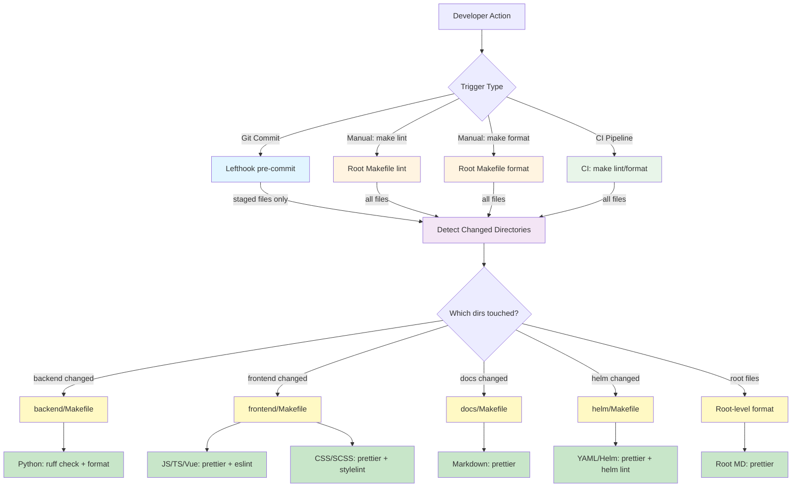

```mermaid
graph TD
    A[Developer Action] --> B{Trigger Type}

    B -->|Git Commit| C[Lefthook pre-commit]
    B -->|Manual: make lint| D[Root Makefile lint]
    B -->|Manual: make format| E[Root Makefile format]
    B -->|CI Pipeline| F[CI: make lint/format]

    C -->|staged files only| G[Detect Changed Directories]
    D -->|all files| G
    E -->|all files| G
    F -->|all files| G

    G --> H{Which dirs touched?}

    H -->|backend changed| I[backend/Makefile]
    H -->|frontend changed| J[frontend/Makefile]
    H -->|docs changed| K[docs/Makefile]
    H -->|helm changed| L[helm/Makefile]
    H -->|root files| M[Root-level format]

    I --> N[Python: ruff check + format]
    J --> O[JS/TS/Vue: prettier + eslint]
    J --> P[CSS/SCSS: prettier + stylelint]
    K --> Q[Markdown: prettier]
    L --> R[YAML/Helm: prettier + helm lint]
    M --> S[Root MD: prettier]

    style C fill:#e1f5ff
    style D fill:#fff4e1
    style E fill:#fff4e1
    style F fill:#e8f5e9
    style G fill:#f3e5f5

    classDef source fill:#bbdefb
    classDef makefile fill:#fff9c4
    classDef tool fill:#c8e6c9

    class I,J,K,L,M makefile
    class N,O,P,Q,R,S tool
```
