# Data Management Page

## Overview

The Data Management Page is the central backoffice interface for configuring and managing CO2 emission data across all modules. It provides year-based configuration, data upload/synchronization, and reduction objective tracking.

**Location**: `frontend/src/pages/back-office/DataManagementPage.vue`

---

## Component Architecture

### Full Hierarchy Tree

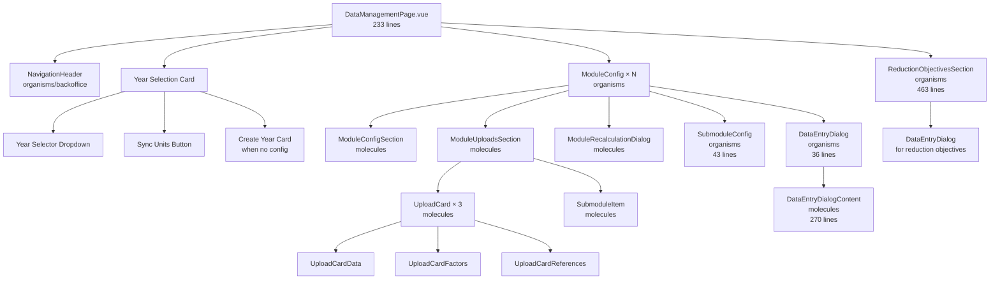

### Component Summary Table

| Type         | Component                        | Lines | Responsibility                                                    |
| ------------ | -------------------------------- | ----- | ----------------------------------------------------------------- |
| **Organism** | `DataManagementPage.vue`         | 233   | Page root: year selection, module iteration, dialog orchestration |
| **Organism** | `ModuleConfig.vue`               | 198   | Single module: expansion item with config, uploads, submodules    |
| **Organism** | `SubmoduleConfig.vue`            | 43    | Renders submodule list within a module                            |
| **Organism** | `DataEntryDialog.vue`            | 36    | Thin wrapper around DataEntryDialogContent                        |
| **Organism** | `ReductionObjectivesSection.vue` | 463   | Reduction objectives: file uploads + 3 goal slots                 |
| **Molecule** | `ModuleConfigSection.vue`        | 101   | Module enable/disable, uncertainty tagging                        |
| **Molecule** | `ModuleUploadsSection.vue`       | 121   | Upload cards + recalculation triggers                             |
| **Molecule** | `DataEntryDialogContent.vue`     | 270   | CSV upload, API connection, copy logic                            |
| **Molecule** | `SubmoduleItem.vue`              | 250   | Individual submodule row with status                              |
| **Molecule** | `ModuleRecalculationDialog.vue`  | 86    | Module-wide recalculation confirmation                            |
| **Molecule** | `ComputedFactorDialog.vue`       | 57    | Computed factor regeneration dialog                               |
| **Molecule** | `UploadCard.vue`                 | 278   | Base upload card with download, cancel, status                    |
| **Molecule** | `UploadCardData.vue`             | 66    | Data upload (CSV/API/copy)                                        |
| **Molecule** | `UploadCardFactors.vue`          | 89    | Factor upload (CSV/computed)                                      |
| **Molecule** | `UploadCardReferences.vue`       | 408   | Self-contained reference data upload with SSE + cancel            |

---

## Composables (Business Logic)

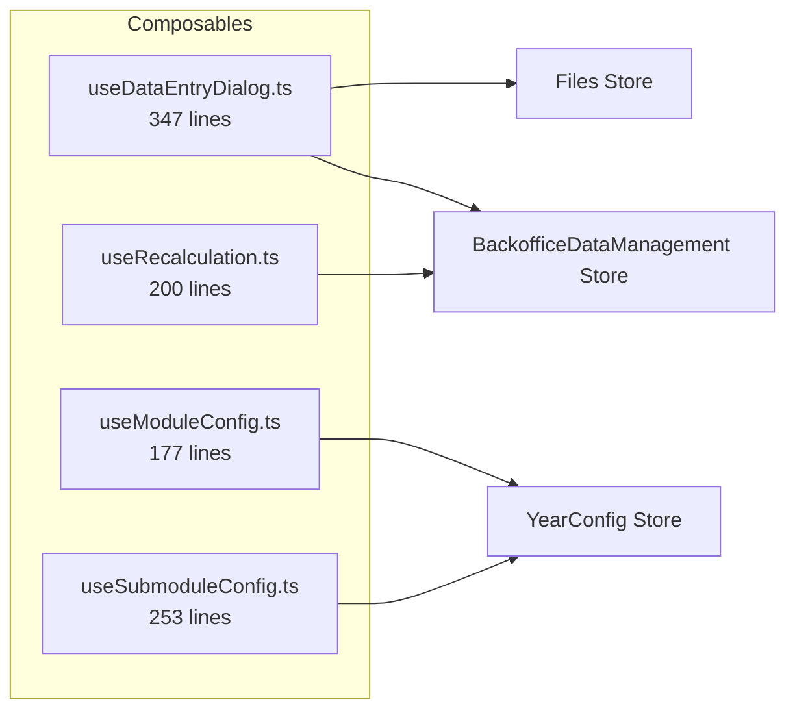

| Composable              | Lines | Responsibility                                                     |
| ----------------------- | ----- | ------------------------------------------------------------------ |
| `useDataEntryDialog.ts` | 347   | CSV upload, API connection, previous year copy, SSE job monitoring |
| `useModuleConfig.ts`    | 177   | Module enable/disable, uncertainty management, job status lookup   |
| `useRecalculation.ts`   | 200   | Recalculation status tracking, trigger module/type recalculation   |
| `useSubmoduleConfig.ts` | 253   | Submodule enable/disable, threshold configuration                  |

---

## Data Flow

### 1. Year Configuration Lifecycle

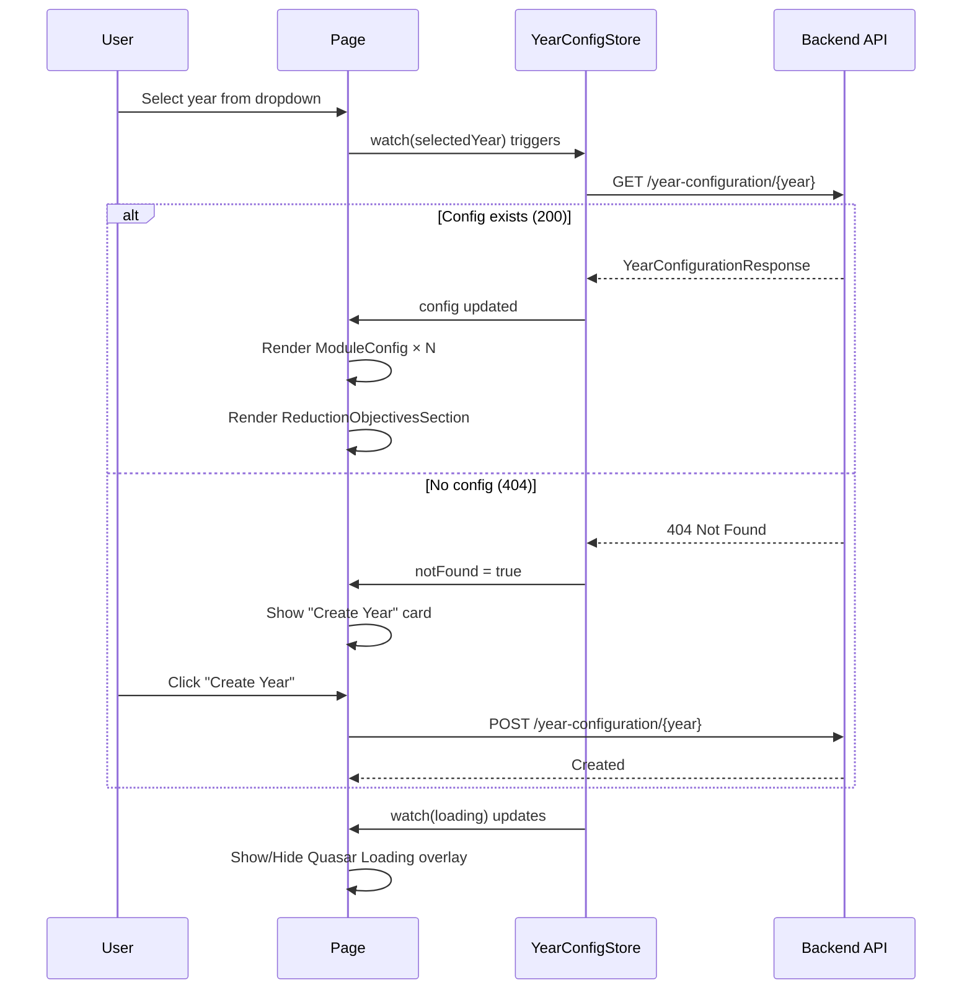

### 2. Data Upload Flow

```mermaid
flowchart TD
    Start[User clicks Upload/Connect] --> OpenDialog[openDataEntryDialog<br/>ImportRow + TargetType]
    OpenDialog --> Dialog[DataEntryDialogContent opens]

    Dialog --> Choice{Choose method}

    Choice -->|CSV| CSV[Select files]
    CSV --> Upload[filesStore.uploadTempFiles<br/>POST /files/temp]
    Upload --> InitCSV[initiateSync provider: csv<br/>POST /sync/dispatch]

    Choice -->|API| API[Fill credentials]
    API --> InitAPI[initiateSync provider: api<br/>POST /sync/dispatch]

    Choice -->|Copy| Copy[loadPreviousYearJobs<br/>GET /sync/jobs/year/{y-1}/latest]
    Copy --> SelectJob[Select job from list]
    SelectJob --> InitCopy[initiateSync provider: copy<br/>POST /sync/dispatch]

    InitCSV --> GetJobId[Returns job_id]
    InitAPI --> GetJobId
    InitCopy --> GetJobId

    GetJobId --> Subscribe[subscribeToJobUpdates<br/>SSE: GET /sync/jobs/{jobId}/stream]

    Subscribe --> Monitor{Monitor progress}
    Monitor -->|Update| Update[Update syncJobs store]
    Update --> Monitor
    Monitor -->|Complete| Complete[On completion handler]

    Complete --> Refresh1[refreshRecalculationStatus]
    Complete --> Refresh2[fetch year config]
    Complete --> Notify[Show notification]

    Notify --> End[Dialog closes]
```

### 3. Recalculation Flow

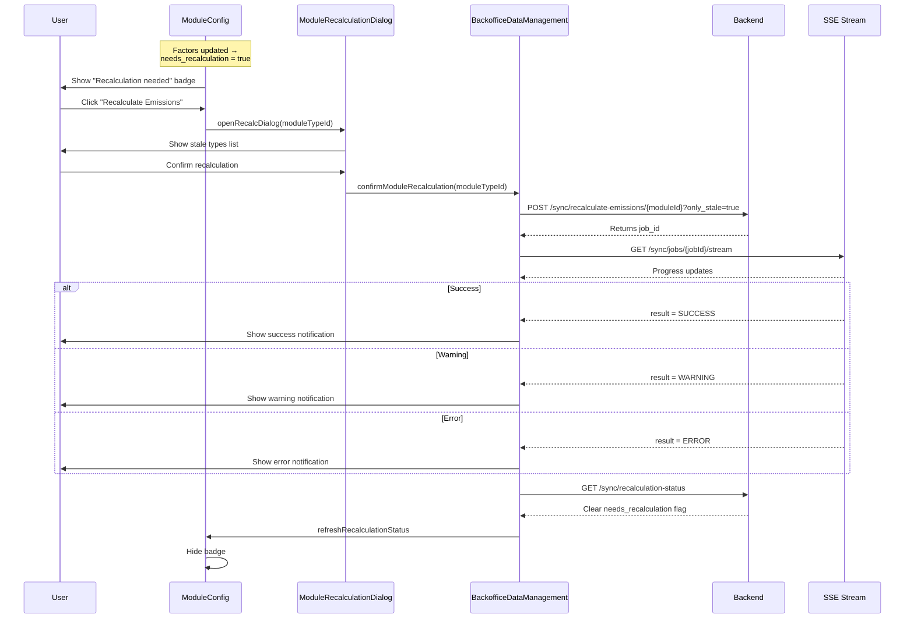

---

## Store Architecture

### useBackofficeDataManagement

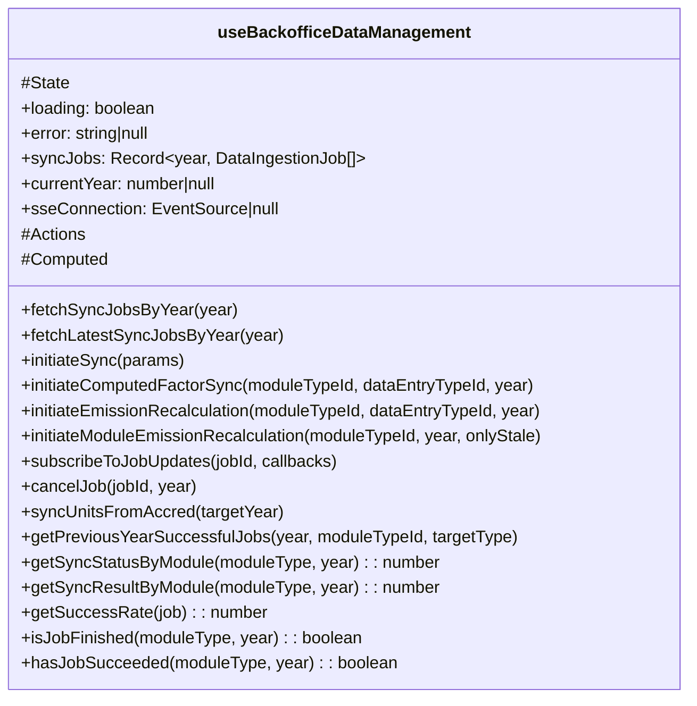

#### Enums

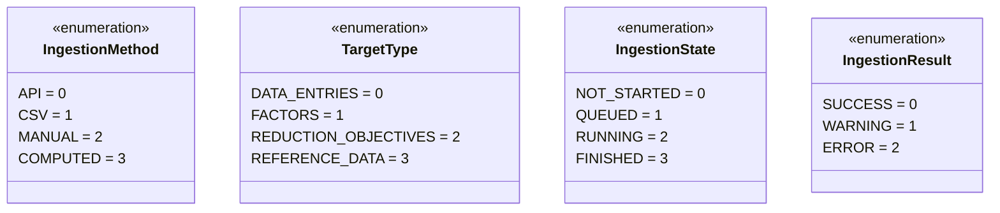

### useYearConfigStore

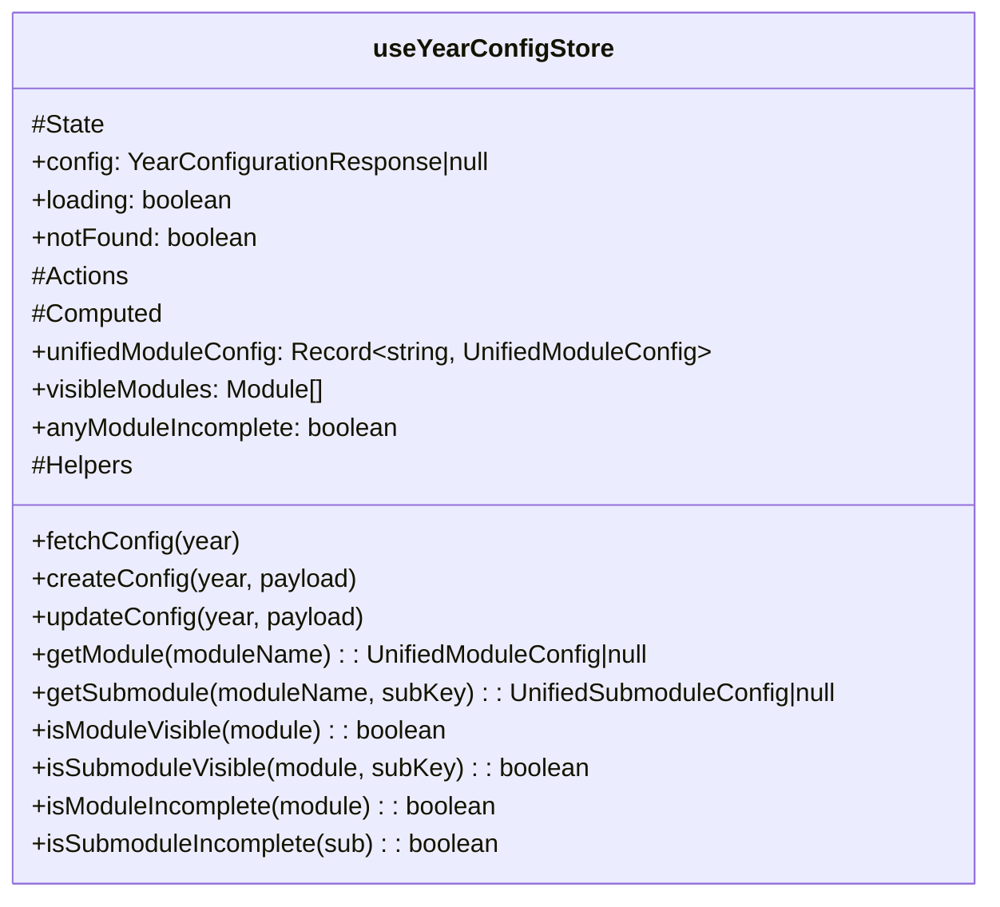

#### Year Configuration Structure

```mermaid
erDiagram
    YearConfigurationResponse {
        number year
        boolean is_started
        boolean is_reports_synced
        YearConfig config
        RecalculationStatusEntry[] recalculation_status
        string updated_at
    }

    YearConfig {
        Record~string, ModuleConfig~ modules
        ReductionObjectives reduction_objectives
    }

    ModuleConfig {
        boolean enabled
        string uncertainty_tag
        Record~string, SubmoduleConfig~ submodules
        SyncJobSummary latest_common_data_job
        SyncJobSummary latest_common_factor_job
    }

    SubmoduleConfig {
        boolean enabled
        number|null threshold
        SyncJobSummary|null latest_data_job
        SyncJobSummary|null latest_api_data_job
        SyncJobSummary|null latest_factor_job
        SyncJobSummary|null latest_reference_job
    }

    ReductionObjectives {
        FileObjects files
        ReductionObjectiveGoal[] goals
    }

    FileObjects {
        FileMetadata institutional_footprint
        FileMetadata population_projections
        FileMetadata unit_scenarios
    }

    ReductionObjectiveGoal {
        number target_year
        number reduction_percentage
        number reference_year
    }

    YearConfigurationResponse ||--|| YearConfig : contains
    YearConfig ||--o{ ModuleConfig : has
    ModuleConfig ||--o{ SubmoduleConfig : has
    ModuleConfig ||--o| SyncJobSummary : latest_common_data_job
    ModuleConfig ||--o| SyncJobSummary : latest_common_factor_job
    YearConfig ||--|| ReductionObjectives : has
    ReductionObjectives ||--o{ ReductionObjectiveGoal : has
```

---

## Static Configuration

### Module/Submodule Structure

```mermaid
flowchart TB
    subgraph MODULE_SUBMODULES
        Headcount[headcount<br/>moduleTypeId: 1]
        Travel[professionalTravel<br/>moduleTypeId: 2]
        Buildings[buildings<br/>moduleTypeId: 3]
        Equipment[equipmentElectricConsumption<br/>moduleTypeId: 4]
        Purchase[purchase<br/>moduleTypeId: 5]
        Research[researchFacilities<br/>moduleTypeId: 6]
        Cloud[externalCloudAndAI<br/>moduleTypeId: 7]
        Process[processEmissions<br/>moduleTypeId: 8]
    end

    Headcount --> H1[member<br/>dataEntryTypeId: 1]
    Headcount --> H2[student<br/>dataEntryTypeId: 2<br/>noData: true]

    Travel --> T1[train<br/>dataEntryTypeId: 21<br/>other: true]
    Travel --> T2[plane<br/>dataEntryTypeId: 20<br/>hasApi: true<br/>other: true]

    Buildings --> B1[building<br/>dataEntryTypeId: 30]
    Buildings --> B2[energy_combustion<br/>dataEntryTypeId: 31]
    Buildings --> B3[building_embodied_energy<br/>dataEntryTypeId: 32<br/>factorsOnly: true]

    Equipment --> E1[scientific<br/>dataEntryTypeId: 10<br/>noData, noFactors]
    Equipment --> E2[it<br/>dataEntryTypeId: 11<br/>noData, noFactors]
    Equipment --> E3[other<br/>dataEntryTypeId: 12<br/>noData, noFactors]
    Equipment --> E4[equipment_common<br/>moduleTypeId: 4]

    Purchase --> P1[scientific_equipment<br/>dataEntryTypeId: 60<br/>noData, noFactors]
    Purchase --> P2[it_equipment<br/>dataEntryTypeId: 61<br/>noData, noFactors]
    Purchase --> P3[consumables<br/>dataEntryTypeId: 62<br/>noData, noFactors]
    Purchase --> P4[services<br/>dataEntryTypeId: 64<br/>noData, noFactors]
    Purchase --> P5[additional_purchases<br/>dataEntryTypeId: 67]
    Purchase --> P6[purchases_common<br/>moduleTypeId: 5]

    Research --> R1[research-facilities<br/>dataEntryTypeId: 70]
    Research --> R2[animal-facilities<br/>dataEntryTypeId: 71]

    Cloud --> C1[external_clouds<br/>dataEntryTypeId: 40]
    Cloud --> C2[external_ai<br/>dataEntryTypeId: 41]

    Process --> Pr1[process_emissions<br/>dataEntryTypeId: 50]
```

### SubmoduleConfig Flags

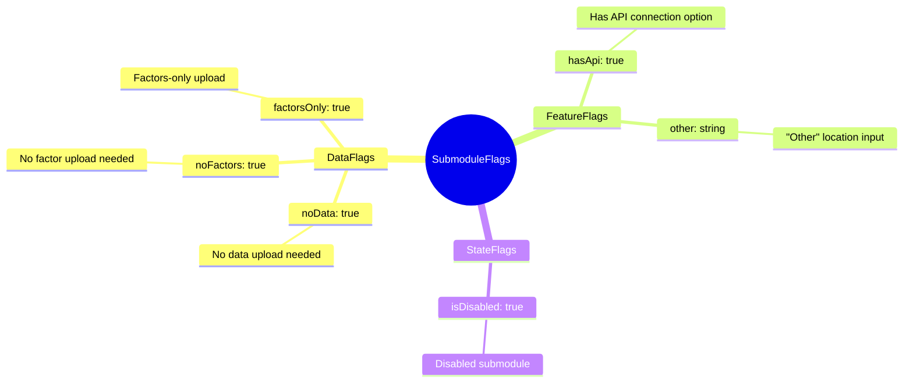

---

## API Endpoints

```mermaid
flowchart LR
    subgraph YearConfiguration
        Y1[GET /year-configuration/{year}]
        Y2[POST /year-configuration/{year}]
        Y3[PATCH /year-configuration/{year}]
    end

    subgraph SyncJobs
        S1[GET /sync/jobs/year/{year}]
        S2[GET /sync/jobs/year/{year}/latest]
        S3[POST /sync/dispatch]
        S4[GET /sync/jobs/{jobId}/stream<br/>SSE]
        S5[POST /sync/factors/{moduleId}/{dataTypeId}]
        S6[POST /sync/recalculate-emissions/{moduleId}]
        S7[POST /sync/units]
        S8[POST /sync/jobs/{jobId}/cancel]
    end

    subgraph Files
        F1[POST /files/temp]
        F2[GET /files/{filePath}]
    end
```

### Request/Response Examples

#### Initiate Sync (POST /sync/dispatch)

```json
{
  "ingestion_method": 1,
  "target_type": 0,
  "year": 2023,
  "filters": {},
  "config": {
    "module_type_id": 1,
    "data_entry_type_id": 1
  },
  "file_path": "/tmp/uploads/file.csv"
}
```

Response:

```json
{
  "job_id": 94
}
```

#### SSE Stream Update

```json
{
  "job_id": 94,
  "module_type_id": 1,
  "target_type": 0,
  "year": 2023,
  "state": 3,
  "result": 0,
  "status_message": "Job finished",
  "meta": {
    "rows_processed": 150,
    "rows_skipped": 5,
    "rows_with_factors": 145,
    "rows_without_factors": 5
  }
}
```

---

## Key Patterns

### 1. Dependency Injection (provide/inject)

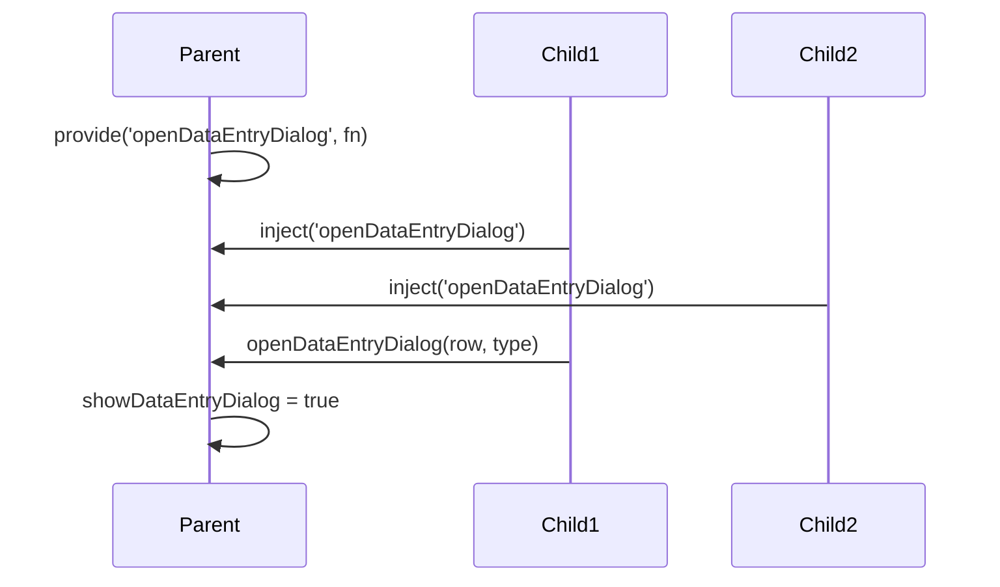

### 2. SSE Job Monitoring

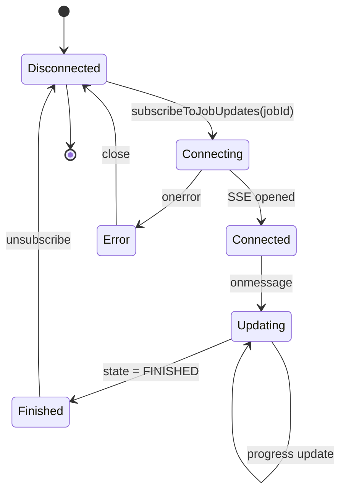

### 3. Unified Config Pattern

```mermaid
flowchart LR
    subgraph Backend
        B[{"1": {enabled: true,<br/>uncertainty_tag: "medium",<br/>submodules: {...},<br/>latest_common_data_job: null,<br/>latest_common_factor_job: null}}]
    end

    subgraph Static
        S[MODULE_SUBMODULES<br/>headcount[0].moduleTypeId = 1]
    end

    subgraph Frontend
        U[unifiedModuleConfig<br/>headcount → {enabled: true}]
    end

    B --> Merge[Merge Process]
    S --> Merge
    Merge --> U
```

### 3b. Common Upload Job Resolution

Modules like Equipment and Purchase have "common uploads" (no `dataEntryTypeId`). Their jobs have `data_entry_type_id = None` in the DB, so they cannot be keyed under a specific submodule. Instead, the backend injects them at the **module level**:

```
ModuleConfig
├── submodules
│   ├── "10" → { latest_data_job: null, latest_factor_job: null }  (scientific, noData)
│   ├── "11" → { latest_data_job: null, latest_factor_job: null }  (it, noData)
│   └── "12" → { latest_data_job: null, latest_factor_job: null }  (other, noData)
├── latest_common_data_job   → { job_id: 5, ... }  ← common data upload
└── latest_common_factor_job → { job_id: 6, ... }  ← common factor upload
```

In `getImportRow()`, when `dataEntryTypeId` is undefined (common uploads), the composable falls back to `mod.latest_common_data_job` / `mod.latest_common_factor_job`.

> **Important**: Config updates (e.g. `updateSubmoduleThreshold`) must send only **targeted partial updates** — never spread the `unifiedModule` object back to the backend, as it contains string-keyed submodules and frontend-only fields that would leak into the DB.

### 4. Job Status Flow

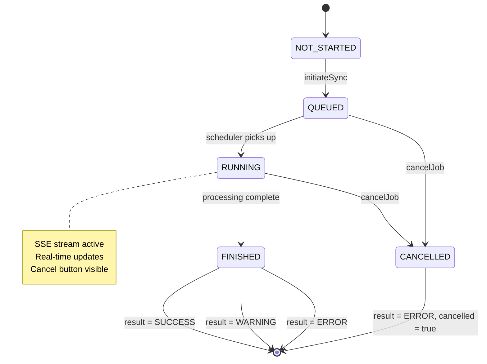

---

## Incomplete Module Detection

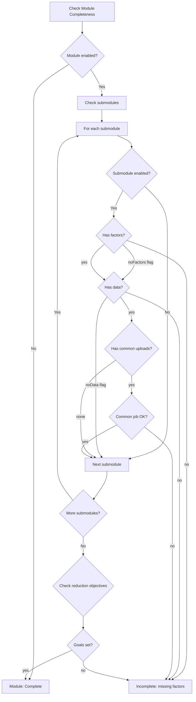

---

## File Structure

```
frontend/src/
├── pages/back-office/
│   ├── DataManagementPage.vue          # Page root (233 lines)
│   └── data-management.md              # This documentation
├── components/
│   ├── organisms/
│   │   └── data-management/
│   │       ├── ModuleConfig.vue            # 198 lines
│   │       ├── SubmoduleConfig.vue         # 43 lines
│   │       ├── DataEntryDialog.vue         # 36 lines
│   │       └── ReductionObjectivesSection.vue # 463 lines
│   └── molecules/
│       └── data-management/
│           ├── ModuleConfigSection.vue
│           ├── ModuleUploadsSection.vue
│           ├── DataEntryDialogContent.vue
│           ├── SubmoduleItem.vue
│           ├── ModuleRecalculationDialog.vue
│           ├── ComputedFactorDialog.vue
│           ├── UploadCard.vue
│           ├── UploadCardData.vue
│           ├── UploadCardFactors.vue
│           └── UploadCardReferences.vue
├── composables/
│   ├── useDataEntryDialog.ts           # 347 lines
│   ├── useModuleConfig.ts              # 177 lines
│   ├── useRecalculation.ts             # 200 lines
│   └── useSubmoduleConfig.ts           # 253 lines
├── stores/
│   ├── backofficeDataManagement.ts     # 728 lines
│   └── yearConfig.ts                   # 480 lines
├── constant/
│   ├── backoffice-module-config.ts     # 225 lines
│   └── modules.ts
└── api/
    └── http.ts                         # 148 lines
```

---

## i18n Keys Reference

### Page-Level

- `data_management_reporting_year`
- `data_management_sync_units_from_accred`
- `data_management_year_not_configured`
- `data_management_year_not_configured_hint`
- `data_management_create_year`
- `data_management_reporting_year_hint`
- `open_year_for_users`
- `data_management_open_year_disabled_tooltip`

### Module-Level

- `data_management_recalculate_emissions`
- `data_management_recalculation_needed`
- `data_management_recalculation_success`
- `data_management_recalculation_warning`
- `data_management_recalculation_error`
- `common_disabled`
- `common_filter_incomplete`

### Reduction Objectives

- `data_management_reduction_objectives`
- `data_management_institution_carbon_footprint_title`
- `data_management_institution_carbon_footprint_description`
- `data_management_population_projections_title`
- `data_management_population_projections_description`
- `data_management_unit_reduction_scenarios_title`
- `data_management_unit_reduction_scenarios_description`
- `data_management_define_reduction_objectives_title`
- `data_management_define_reduction_objectives_description`

### Uploads

- `common_upload_csv`
- `csv_sync_completed`
- `csv_sync_completed_with_warnings`
- `csv_sync_failed`
- `csv_sync_success_caption`
- `csv_sync_warnings_caption`
- `csv_sync_connection_lost`
- `data_management_connection_failed`
- `data_management_no_previous_jobs`
- `data_management_copy_failed`
- `data_management_job_in_progress`
- `data_management_cancel_job`

### Config

- `year_config_saved`
- `year_config_save_error`
- `year_config_target_year_error`
- `year_config_percentage_error`
- `year_config_reference_year_error`

---

## Troubleshooting

### Common Issues

```mermaid
flowchart TD
    Issue[Problem Reported] --> Symptom{Symptom}

    Symptom -->|Year not configured| S1[Check notFound flag]
    S1 --> Fix1[Ensure createConfig<br/>succeeds before refetch]

    Symptom -->|Upload success<br/>but no data| S2[Check recalculationStatus]
    S2 --> Fix2[Trigger recalculation<br/>for module]

    Symptom -->|SSE drops| S3[Check network tab]
    S3 --> Fix3[Job may complete<br/>refresh to see status]

    Symptom -->|Module incomplete| S4[Check latestJobs]
    S4 --> Fix4[Look for failed/warning<br/>jobs in store]

    Symptom -->|Cannot copy| S5[Check previous year]
    S5 --> Fix5[Must have state=FINISHED<br/>result=SUCCESS]

    Symptom -->|Job stuck RUNNING| S6[Backend may have restarted]
    S6 --> Fix6[Use cancel button or<br/>POST /sync/jobs/{id}/cancel]

    Symptom -->|Common upload<br/>no status/download| S7[Check latest_common_data_job<br/>at module level in config]
    S7 --> Fix7[Ensure backend enrichment<br/>includes common jobs]

    Fix1 --> Resolved
    Fix2 --> Resolved
    Fix3 --> Resolved
    Fix4 --> Resolved
    Fix5 --> Resolved

    Resolved[Issue Resolved]
```

### Debug Checklist

1. **Check store state in browser console:**

   ```javascript
   // Access stores from console
   const yearConfig = useYearConfigStore();
   console.log('Config:', yearConfig.config);
   console.log('Not found:', yearConfig.notFound);

   const dataManagement = useBackofficeDataManagement();
   console.log('Sync jobs:', dataManagement.syncJobs);
   ```

2. **Verify API responses:**
   - Open Network tab
   - Filter by `year-configuration` or `sync`
   - Check response payloads

3. **Check SSE connection:**
   ```javascript
   // In browser console after initiating sync
   const store = useBackofficeDataManagement();
   console.log('SSE Connection:', store.sseConnection);
   ```

---

## Future Improvements

- [ ] Dynamic available years (currently hardcoded `MIN_YEARS = 2024`)
- [ ] Download reduction objective files (TODO in code)
- [ ] Batch recalculation for multiple modules
- [ ] Export year configuration
- [ ] Import year configuration from JSON
- [ ] Real-time collaboration (multiple admins)
- [ ] Audit trail for configuration changes
- [x] Progress indicators for long-running uploads (SSE + cancel button)
- [ ] Bulk operations (enable/disable multiple modules)
- [ ] Template configurations for new years
